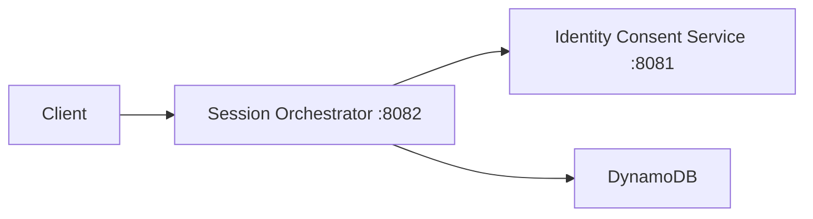

# EchoLife Session Orchestrator Service

Spring Boot microservice responsible for managing EchoLife user sessions. It authenticates requests using JWT, validates session access through the Identity Consent Service, and stores session data in DynamoDB.

## Overview

- **Port:** `8082`
- **Database:** DynamoDB
- **Identity Service:** `http://localhost:8081`
- **Java:** 21
- **Spring Boot:** 4.1.1
- **Build:** Maven

### Architecture



## Technology Stack

| Technology | Purpose |
|---|---|
| Java 21 | Backend |
| Spring Boot 4.1.1 | Framework |
| Spring Security | Authentication |
| OAuth2 Resource Server | JWT validation |
| AWS SDK 2.47.6 | DynamoDB |
| Maven | Build |
| Docker Compose | Local DynamoDB |

## Project Structure

```text
session-orchestrator-service/
├── src/main/java/com/echolife/session/
│   ├── client/
│   ├── config/
│   ├── controller/
│   ├── model/
│   └── service/
├── src/main/resources/
│   └── application.yml
├── keys/
│   └── public.pem
├── docker-compose.yml
├── .env.example
└── pom.xml
```

## Prerequisites

- JDK 21
- Maven
- Docker Desktop
- Identity Consent Service running on port `8081`
- JWT public key

## Environment Configuration

Create `.env` from `.env.example`.

| Variable | Description |
|---|---|
| `ECHOLIFE_PUBLIC_KEY_PATH` | JWT public key |
| `ECHOLIFE_JWT_ISSUER` | JWT issuer |
| `IDENTITY_BASE_URL` | Identity service URL |
| `DYNAMODB_ENDPOINT` | DynamoDB endpoint |
| `DYNAMODB_SESSION_TABLE` | Session table |
| `DYNAMODB_AUTO_CREATE_TABLE` | Auto-create table |
| `AWS_REGION` | AWS region |
| `AWS_ACCESS_KEY_ID` | AWS access key |
| `AWS_SECRET_ACCESS_KEY` | AWS secret key |
| `ECHOLIFE_CORS_ALLOWED_ORIGINS` | Allowed frontend origins |

Do not commit `.env`, credentials, or private keys.

## DynamoDB

The project includes DynamoDB Local through Docker Compose.

```bash
docker compose up -d dynamodb
```

Default endpoint:

```text
http://localhost:8000
```

Default table:

```text
echolife-sessions
```

No Flyway or Liquibase migrations are used.

## Local Setup

```bash
# Configure .env from .env.example

docker compose up -d dynamodb

mvn clean install

mvn spring-boot:run
```

Application:

```text
http://localhost:8082
```

## API Endpoints

| Method | Endpoint | Description | Auth |
|---|---|---|---|
| `POST` | `/api/v1/sessions` | Start session | Required |
| `GET` | `/api/v1/sessions/{sessionId}` | Get session | Required |
| `POST` | `/api/v1/sessions/{sessionId}/end` | End session | Required |

Protected APIs require:

```text
Authorization: Bearer <ACCESS_TOKEN>
```

### Health Check

```bash
curl http://localhost:8082/actuator/health
```

```bash
curl http://localhost:8082/actuator/health/readiness
```

## Authentication

The service uses JWT bearer authentication with RSA signature validation.

JWT validation includes:

- Signature
- Issuer
- Audience: `echolife-session`

The JWT subject is used as the authenticated user ID.

## Inter-Service Communication

The Session Orchestrator calls the Identity Consent Service:

```text
POST http://localhost:8081/api/v1/internal/session-access-check
```

The Identity Consent Service must be running separately.

## Docker Commands

```bash
docker compose up -d dynamodb
docker compose ps
docker compose logs -f dynamodb
docker compose down
```

## Troubleshooting

| Problem | Solution |
|---|---|
| Port `8082` in use | Stop the process or change `server.port` |
| DynamoDB unavailable | Start `docker compose up -d dynamodb` |
| JWT error | Check public key, issuer and audience |
| Identity service unavailable | Start Identity Consent Service and verify `IDENTITY_BASE_URL` |
| Maven build failure | Verify JDK 21 and run `mvn clean install` |

## Known Setup Issues

- Internal service key is currently hard-coded in `IdentityConsentClient.java`; move it to secure configuration.
- `.env` should not be committed.
- Root `.gitignore` is not included.
- Private signing keys must be managed securely.
- Docker Compose starts DynamoDB only.
- No automated tests are currently included.

## Production Considerations

Before deployment:

- Use a secret manager for credentials and keys.
- Never commit `.env` or private keys.
- Use managed DynamoDB instead of DynamoDB Local.
- Configure HTTPS and restricted CORS.
- Configure production JWT keys and issuer.
- Review Actuator and logging configuration.

## Quick Start

```bash
docker compose up -d dynamodb
mvn clean install
mvn spring-boot:run
```

Verify:

```bash
curl http://localhost:8082/actuator/health
```